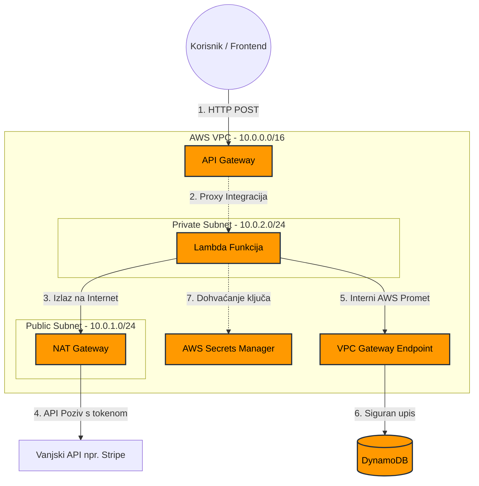

# AWS-Secure-Order-Processor-Integracija-Serverless-Arhitekture-i-Sigurnosti
Ovaj projekt demonstrira implementaciju sigurne, visoko dostupne i skalabilne serverless arhitekture na AWS-u. Sustav simulira backend proces checkouta u web shopu, odvajajući javni API sloj od privatnog sloja za obradu podataka i pohranu.

Proces Implementacije (Dokumentiran Snimkama Zaslona)
Ovaj repozitorij služi kao dokaz praktičnog razumijevanja AWS infrastrukture i sigurnosnih principa po principu najmanje privilegije (Least Privilege).

1. Konfiguracija VPC-a i Mrežna Izolacija
Započelo se s kreiranjem prilagođenog VPC-a (10.0.0.0/16) s dva subneta:

Public Subnet (10.0.1.0/24): Sadrži NAT Gateway i ima rutu prema Internet Gatewayu (IGW).

Private Subnet (10.0.2.0/24): Ovdje je smještena Lambda funkcija. Izlazni promet usmjeren je prema NAT Gatewayu.

