 # AWS-Sustav-Za-Sigurnu-Obradu-Narudzbi-Integracija-Serverless-Arhitekture-i-Sigurnosti
Ovaj projekt demonstrira implementaciju sigurne, visoko dostupne i skalabilne serverless arhitekture na AWS-u. Sustav simulira backend proces checkouta u web shopu, odvajajući javni API sloj od privatnog sloja za obradu podataka i pohranu.

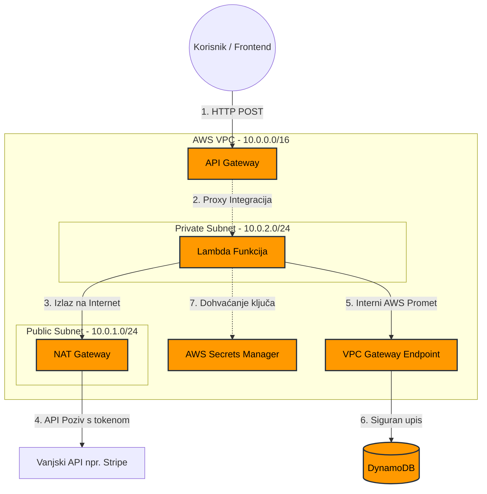

Proces Implementacije (dokumentiran snimkama zaslona)
Ovaj repozitorij služi kao dokaz praktičnog razumijevanja AWS infrastrukture i sigurnosnih principa po principu najmanje privilegije (Least Privilege).

1. Konfiguracija VPC-a i Mrežna Izolacija

   
Započelo se s kreiranjem prilagođenog VPC-a (10.0.0.0/16) s dva subneta:

Public Subnet (10.0.1.0/24): Sadrži NAT Gateway i ima rutu prema Internet Gatewayu (IGW).

Private Subnet (10.0.2.0/24): Ovdje je smještena Lambda funkcija. Izlazni promet usmjeren je prema NAT Gatewayu.

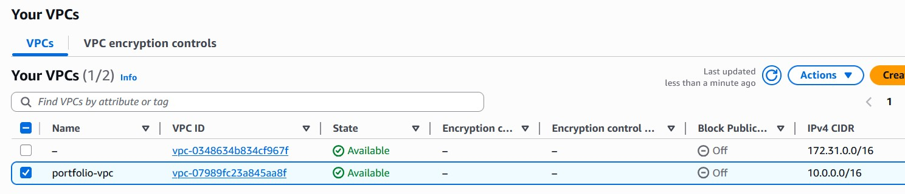

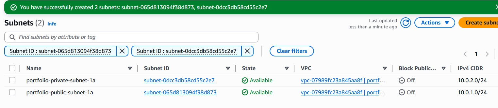

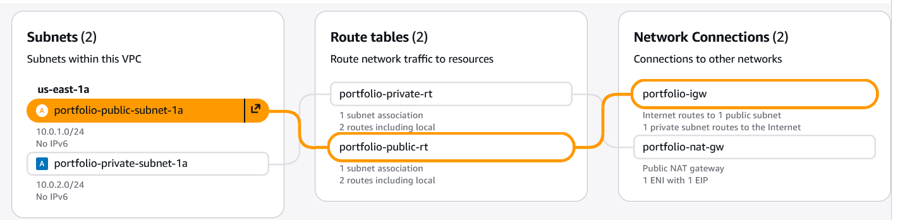

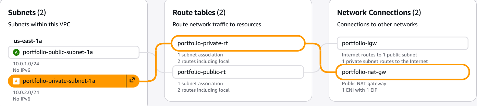

2. Sigurna pohrana podataka i optimizacija troškova
Za pohranu narudžbi korištena je DynamoDB tablica. Kako bi se osiguralo da promet ne izlazi na javni internet i kako bi se smanjili troškovi prijenosa podataka kroz NAT Gateway, implementiran je VPC Gateway Endpoint za DynamoDB.

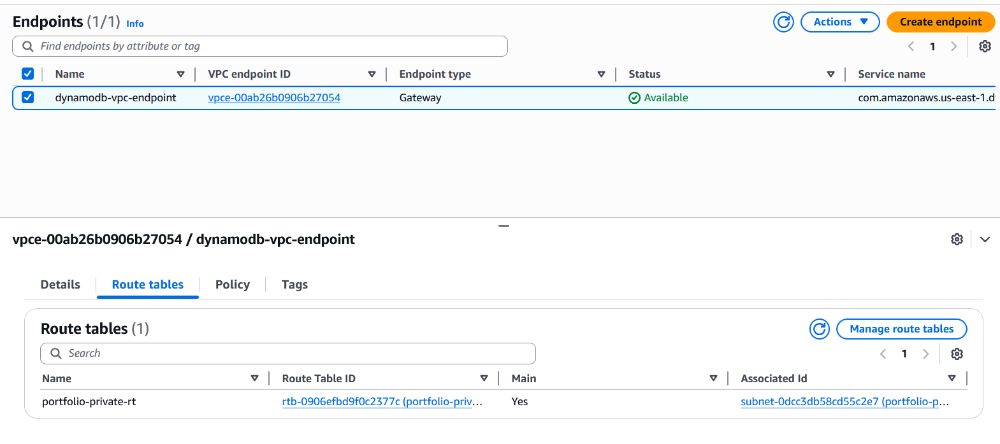

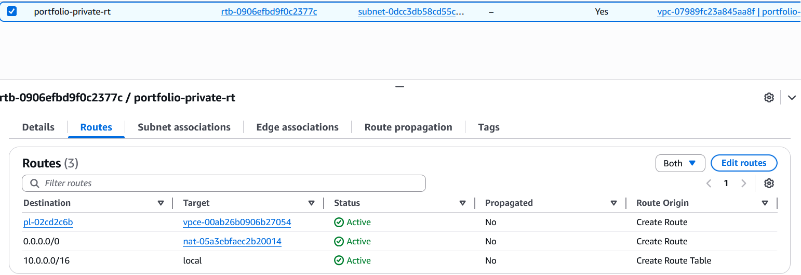

3. Poslovna Logika u Privatnom okruženju (Lambda)
Lambda funkcija (Python) prima zahtjeve od API Gatewaya.

Dodijeljena joj je IAM uloga s AWSLambdaVPCAccessExecutionRole dozvolom za kreiranje ENI-ja u privatnom subnetu, te dozvolom za pisanje u bazu.

Smještena je isključivo u privatni subnet.

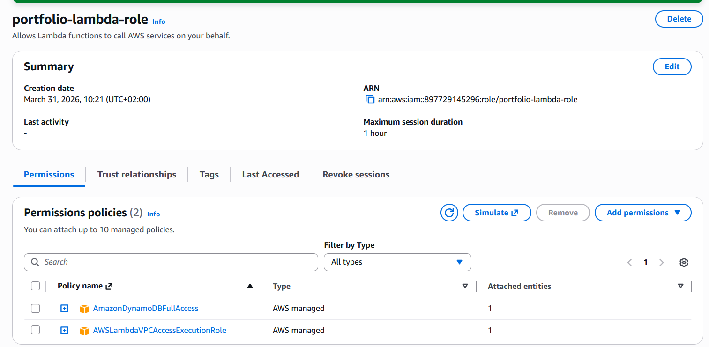

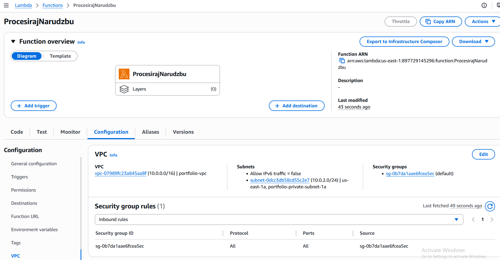

4. Javno Sučelje (API Gateway)
Kreiran je REST API (/narudzba POST metoda) koji služi kao ulazna točka za klijente.

Korištena je Lambda Proxy Integration za prosljeđivanje kompletnog HTTP zahtjeva privatnoj Lambda funkciji.

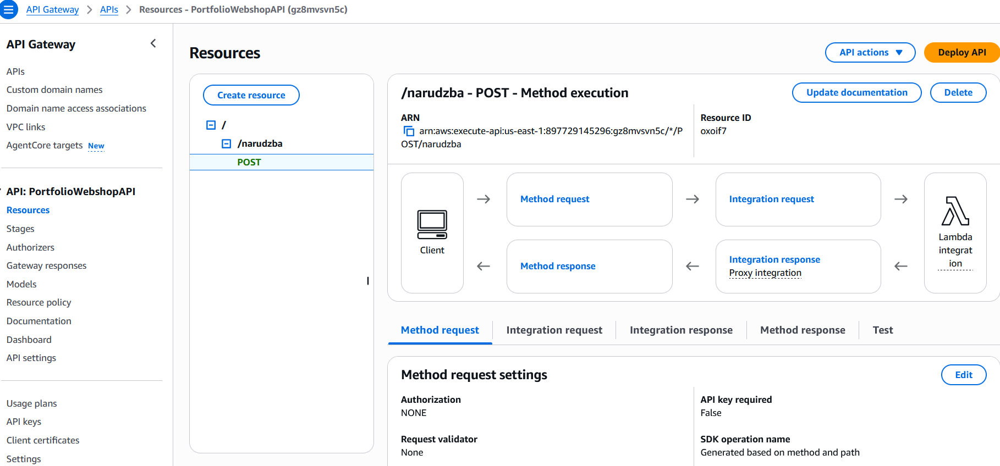

Rezultati Testiranja

Sustav je uspješno testiran slanjem POST zahtjeva na produkcijski endpoint API Gatewaya.

API Gateway uspješno prosljeđuje zahtjev u privatnu mrežu.

Lambda funkcija  vraća status 200 OK.

Zapis je uspješno kreiran u DynamoDB tablici.

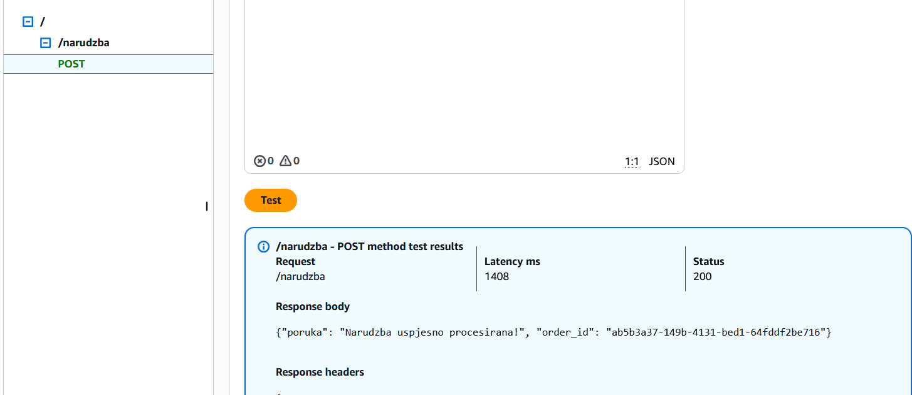

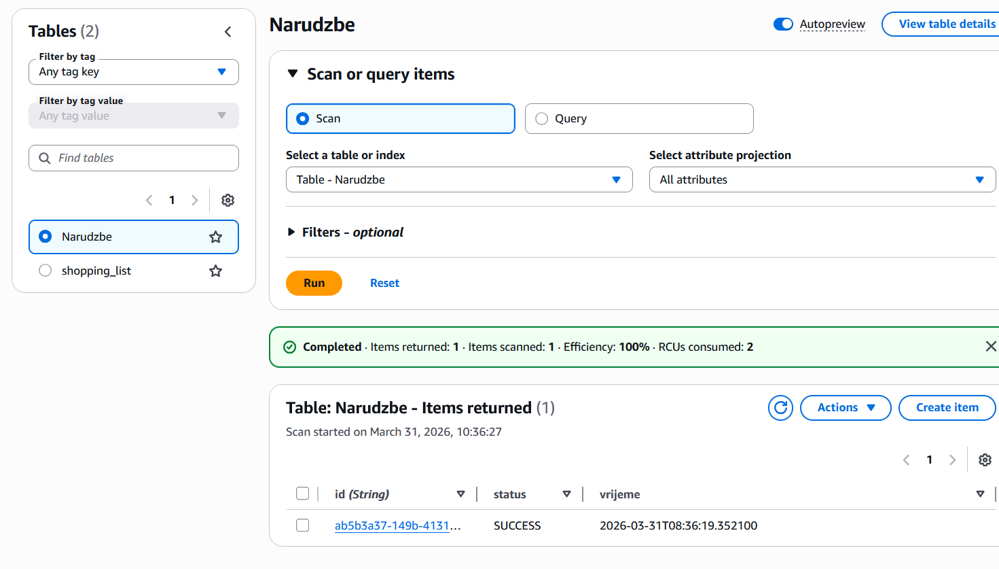

